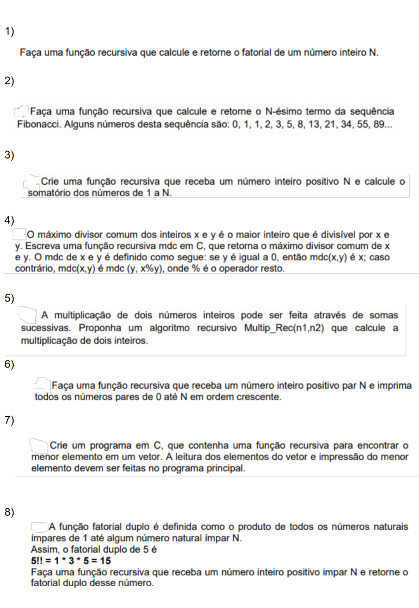

# Desafio Desafiante

Encontrei esse [post](https://www.reddit.com/r/brdev/comments/1bwv8e0/como_compreender_recursividade_em_estrutura_de/#lightbox) com alguns problemas de lógica e estrutura de dados e quis me desafiar a resolver os problemas propostos.

